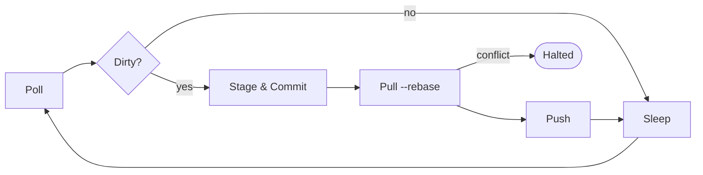
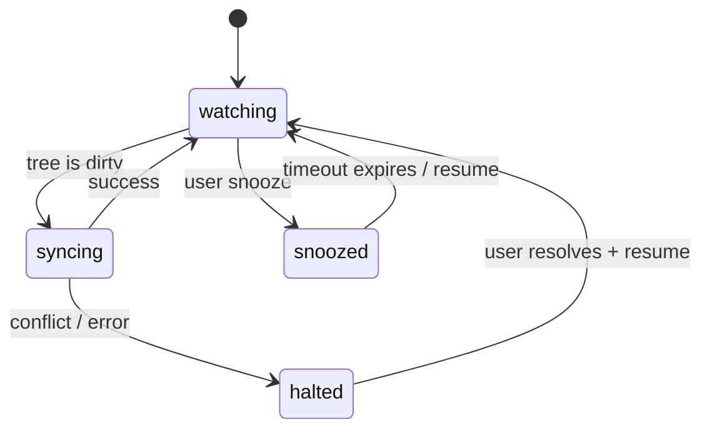

# Sexton

Git-based repository synchronization agent. Keeps local git repos in sync with their remotes by polling for changes, committing with LLM-generated summaries, and pushing -- halting on conflicts it cannot resolve.

Designed for knowledge repositories and datasets (markdown collections, config stores, structured data), not code repos.

This allows you to create automatically synchronized repositories across multiple systems.

## How it works

Sexton runs a per-repo sync loop on a fixed poll interval:



- **Clean tree**: no-op, sleep until next poll
- **Dirty tree**: stage all, generate a commit message via LLM, commit, pull --rebase, push
- **Conflict**: abort the rebase, halt the repo, alert the user

Sexton never silently loses data. On any unrecoverable error it halts and waits for you.

## Installation

```bash
go install github.com/michaelquigley/sexton/cmd/sexton@latest
```

Or build from source:

```bash
go build ./cmd/sexton
```

## Configuration

### Global config

`~/.config/sexton/config.yaml` (or `$XDG_CONFIG_HOME/sexton/config.yaml`):

```yaml
llm:
  endpoint: "http://localhost:8080/v1/chat/completions"
  model: "claude-sonnet-4-20250514"
  api_key_env: "SEXTON_LLM_API_KEY"
  max_tokens: 512

defaults:
  poll_interval: 30s
  branch: main
  remote: origin

alerts:
  - type: log

repos:
  - path: ~/grimoire
  - path: ~/datasets/research
    name: research
    poll_interval: 60s
```

### Repo-local config

Place a `.sexton.yaml` in the repo root to override global settings:

```yaml
poll_interval: 15s
branch: main
commit_message_prompt: |
  Summarize this diff as a commit message for a personal knowledge base.
  Be brief. Use present tense.
```

### Config fields

| Field | Scope | Default | Description |
|---|---|---|---|
| `llm.endpoint` | global | (required) | LLM API endpoint URL |
| `llm.model` | global | (required) | Model identifier |
| `llm.api_key_env` | global | -- | Env var containing the API key |
| `llm.max_tokens` | global | `512` | Max tokens for diff context sent to LLM |
| `name` | repo | basename of path | Display name for the repo |
| `poll_interval` | global, repo | `30s` | Duration between poll cycles |
| `branch` | global, repo | `main` | Branch to sync |
| `remote` | global, repo | `origin` | Git remote name |
| `commit_message_prompt` | global, repo | (built-in) | System prompt for LLM commit summarization |

### Cascade order

Repo-local config > global repo entry > global defaults > built-in defaults.

## Usage

### Start the agent

```bash
sexton agent --config path/to/config.yaml
```

Runs in the foreground. Suitable for systemd or launchd.

### Query status

```bash
sexton status          # all repos
sexton status grimoire # specific repo
```

### Trigger immediate sync

```bash
sexton sync grimoire
```

### Snooze a repo

```bash
sexton snooze grimoire 1h
```

### Resume a halted or snoozed repo

```bash
sexton resume grimoire
```

## Repo states



- **watching** -- polling on the configured interval
- **syncing** -- executing stage, commit, pull, push
- **halted** -- unrecoverable error; waiting for user intervention
- **snoozed** -- temporarily paused; auto-expires after the specified duration

## Commit messages

Sexton sends the staged diff (or `--stat` for large diffs) to the configured LLM and uses the response as the commit message. If the LLM is unavailable, it falls back to a mechanical summary:

```
sexton: modified 3 files, added 1, deleted 0
```

## Control plane

The agent exposes a gRPC service over a Unix domain socket at `~/.config/sexton/sexton.sock`. The CLI subcommands (`status`, `sync`, `snooze`, `resume`) communicate with the running agent over this socket.

## License

See [LICENSE](LICENSE).
