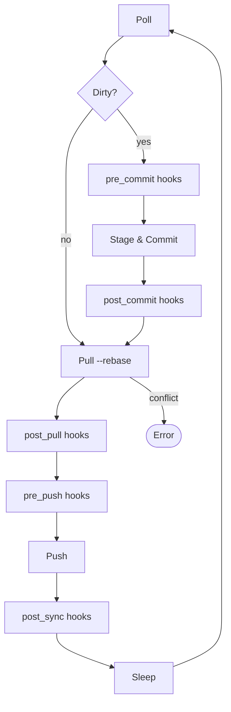
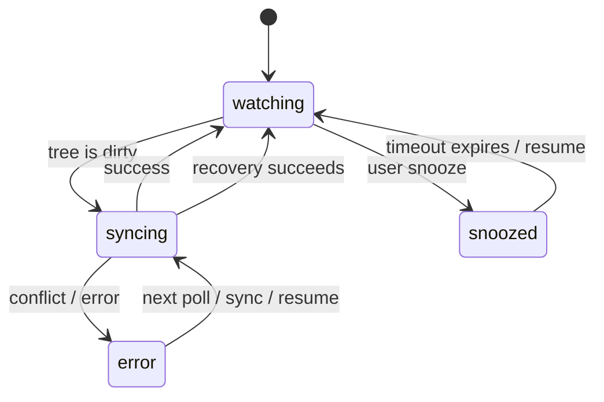

# Sexton

Git-based repository synchronization agent. Keeps local git repos in sync with their remotes by polling for changes, committing with LLM-generated summaries, and pushing while surfacing per-repo errors it cannot immediately resolve.

Designed for knowledge repositories and datasets (markdown collections, config stores, structured data), not code repos.

This allows you to create automatically synchronized repositories across multiple systems.

## How it works

Sexton runs a per-repo sync loop on a fixed poll interval:



- **Clean tree**: pull, run post_pull/pre_push/post_sync hooks, push, sleep
- **Dirty tree**: run pre_commit hooks, stage all, generate a commit message via LLM, commit, run post_commit hooks, pull --rebase, run post_pull/pre_push hooks, push, run post_sync hooks
- **Conflict**: abort the rebase, mark the repo errored, alert the user
- **Hook failure**: mark the repo errored, alert the user

Sexton never silently loses data. On any unrecoverable error it marks the affected repo errored, reports it in status, and keeps retrying until the underlying issue is fixed.

## Installation

```bash
go install github.com/michaelquigley/sexton/cmd/sexton@latest
```

Or build from source:

```bash
go build ./cmd/sexton
```

## Configuration

### Global config

`~/.config/sexton/config.yaml` (or `$XDG_CONFIG_HOME/sexton/config.yaml`):

```yaml
llm:
  endpoint: "http://localhost:8080/v1/chat/completions"
  model: "claude-sonnet-4-20250514"
  api_key_env: "SEXTON_LLM_API_KEY"
  max_tokens: 512

defaults:
  poll_interval: 30s
  branch: main
  remote: origin

alerts:
  - type: log

repos:
  - path: ~/grimoire
    hooks:
      post_pull:
        - command: "lore sync"
          timeout: 60s
  - path: ~/datasets/research
    name: research
    poll_interval: 60s
```

### Repo-local config

Place a `.sexton.yaml` in the repo root to override global settings:

```yaml
poll_interval: 15s
branch: main
commit_message_prompt: |
  Summarize this diff as a commit message for a personal knowledge base.
  Be brief. Use present tense.
hooks:
  post_pull:
    - command: "lore sync"
      env:
        LORE_VERBOSE: "true"
```

### Config fields

| Field | Scope | Default | Description |
|---|---|---|---|
| `llm.endpoint` | global | (required) | LLM API endpoint URL |
| `llm.model` | global | (required) | Model identifier |
| `llm.api_key_env` | global | -- | Env var containing the API key |
| `llm.max_tokens` | global | `512` | Max tokens for diff context sent to LLM |
| `name` | repo | basename of path | Display name for the repo |
| `poll_interval` | global, repo | `30s` | Duration between poll cycles |
| `branch` | global, repo | `main` | Branch Sexton requires the repo to be checked out on before syncing |
| `remote` | global, repo | `origin` | Git remote Sexton explicitly pulls from and pushes to |
| `commit_message_prompt` | global, repo | (built-in) | System prompt for LLM commit summarization |
| `hooks.pre_commit` | global, repo | -- | Commands to run before staging and committing |
| `hooks.post_commit` | global, repo | -- | Commands to run after a successful commit |
| `hooks.post_pull` | global, repo | -- | Commands to run after a successful pull |
| `hooks.pre_push` | global, repo | -- | Commands to run before pushing |
| `hooks.post_sync` | global, repo | -- | Commands to run after a successful sync cycle |

Each hook entry has a `command` (shell string) and optional `timeout` (default `30s`), `dir` (working directory, defaults to repo root), and `env` (map of additional environment variables).

### Cascade order

Repo-local config > global repo entry > global defaults > built-in defaults.

For hooks, the cascade is per-phase replacement -- if `.sexton.yaml` defines `post_pull` hooks, they replace any `post_pull` hooks from the global config entirely (not concatenated).

### Lifecycle hooks

Hooks run shell commands at phase boundaries in the sync loop. Each hook runs with the repo root as working directory (override with `dir`) and receives `SEXTON_REPO_PATH`, `SEXTON_REPO_NAME`, and `SEXTON_HOOK` environment variables plus any custom variables from `env`. Multiple hooks per phase run sequentially in declaration order. A hook that exits non-zero halts the agent.

| Hook | When it fires |
|---|---|
| `pre_commit` | After dirty check, before staging (dirty cycles only) |
| `post_commit` | After successful commit (dirty cycles only) |
| `post_pull` | After successful pull (every cycle) |
| `pre_push` | Before push |
| `post_sync` | After entire sync cycle succeeds (every cycle) |

## Usage

### Start the agent

```bash
sexton agent --config path/to/config.yaml
```

Runs in the foreground. Suitable for systemd or launchd.

### Query status

```bash
sexton status          # all repos
sexton status grimoire # specific repo
```

The `BRANCH` column shows the repo's actual current checkout. If it differs from the configured `branch`, the repo enters `error` with a mismatch message.

### Trigger immediate sync

```bash
sexton sync grimoire
```

### Snooze a repo

```bash
sexton snooze grimoire 1h
```

### Resume a snoozed or errored repo

```bash
sexton resume grimoire
```

`resume` is still useful for clearing a snooze or forcing an immediate retry for an errored repo, but normal recovery no longer depends on it.

## Repo states



- **watching** -- polling on the configured interval
- **syncing** -- executing stage, commit, pull, push
- **error** -- last sync attempt failed; visible in status and retried automatically
- **snoozed** -- temporarily paused; auto-expires after the specified duration

## Commit messages

Sexton sends the staged diff (or `--stat` for large diffs) to the configured LLM and uses the response as the commit message. If the LLM is unavailable, it falls back to a mechanical summary:

```
sexton: modified 3 files, added 1, deleted 0
```

## Control plane

The agent exposes a gRPC service over a Unix domain socket at `~/.config/sexton/sexton.sock`. The CLI subcommands (`status`, `sync`, `snooze`, `resume`) communicate with the running agent over this socket.

## License

See [LICENSE](LICENSE).
