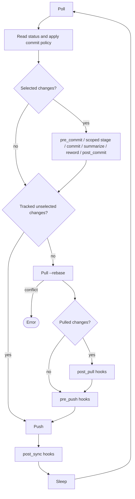
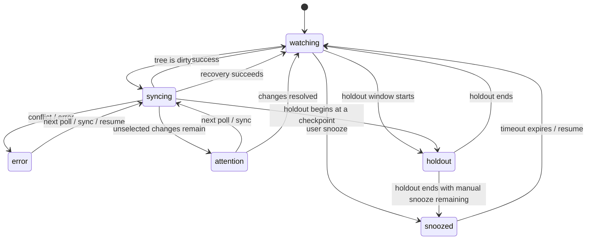

# Sexton

Git-based repository synchronization agent. Keeps local git repos in sync with their remotes by polling for changes, committing selected changes with LLM-generated summaries, and pushing while surfacing per-repo errors and changes that need an operator's attention.

Designed for knowledge repositories and datasets (markdown collections, config stores, structured data), not code repos.

This allows you to create automatically synchronized repositories across multiple systems.

## How it works

Sexton runs a per-repo sync loop on a fixed poll interval:


```mermaid
flowchart TD
    poll[Poll] --> partition[Read status and apply commit policy]
    partition --> selected{Selected changes?}
    selected -- yes --> commit[pre_commit / scoped stage / commit / summarize / reword / post_commit]
    selected -- no --> attention
    commit --> attention{Tracked unselected changes?}
    attention -- yes --> push
    attention -- no --> pull[Pull --rebase]
    pull --> pulled{Pulled changes?}
    pulled -- yes --> post_pull[post_pull hooks]
    pulled -- no --> pre_push[pre_push hooks]
    post_pull --> pre_push[pre_push hooks]
    pre_push --> push[Push]
    push --> post_sync[post_sync hooks]
    post_sync --> sleep[Sleep]
    sleep --> poll
    pull -- conflict --> error([Error])
```

- **Selected changes**: commit only what `commit_policy` permits, describe that exact commit with the LLM or the mechanical fallback, then atomically replace its placeholder message
- **Unselected changes**: enter `attention` and name the paths; tracked changes pause pulls while untracked-only changes do not
- **Every completed cycle**: run post_pull hooks only when the pull changed the repo, then pre_push, push, and post_sync; pushes continue while a repo is in `attention`
- **Conflict**: abort the rebase, mark the repo errored, alert the user
- **Hook failure**: mark the repo errored, alert the user

Sexton never silently loses data. On any unrecoverable error it marks the affected repo errored, reports it in status, and keeps retrying until the underlying issue is fixed.

## Installation

```bash
go install github.com/michaelquigley/sexton/cmd/sexton@latest
```

Or build from source:

```bash
go build ./cmd/sexton
```

## Configuration

### Global config

`~/.config/sexton/config.yaml` (or `$XDG_CONFIG_HOME/sexton/config.yaml`):

```yaml
llm:
  endpoint: "http://localhost:8080/v1/chat/completions"
  model: "claude-sonnet-4-20250514"
  api_key: "sk-your-key" # or api_key_env: "SEXTON_LLM_API_KEY" for a key from the environment
  max_tokens: 512

defaults:
  poll_interval: 30s
  branch: main
  remote: origin
  ssh_key: ~/.ssh/sexton_deploy
  commit_policy: none
  holdout_windows:
    - start: "02:00"
      end: "02:30"

alerts:
  - type: log
  - type: mattermost
    mattermost:
      url: "https://mattermost.example.com"
      token_env: "SEXTON_MATTERMOST_TOKEN"
      channel_id: "alerts-channel-id"
      mention_users: [michael]

repos:
  - path: ~/grimoire
    commit_policy: regions
    commit_regions: [journal/]
    hooks:
      post_pull:
        - command: "lore sync"
          timeout: 60s
  - path: ~/datasets/research
    name: research
    poll_interval: 60s
    commit_policy: all
    holdout_windows:
      - start: "23:30"
        end: "00:15"
```

### Repo-local config

Place a `.sexton.yaml` in the repo root to override global settings:

```yaml
poll_interval: 15s
branch: main
commit_policy: regions
commit_regions:
  - journal/
commit_message_prompt: |
  Summarize this diff as a commit message for a personal knowledge base.
  Be brief. Use present tense.
holdout_windows:
  - start: "01:00"
    end: "01:20"
hooks:
  post_pull:
    - command: "lore sync"
      env:
        LORE_VERBOSE: "true"
```

### Config fields

| Field | Scope | Default | Description |
|---|---|---|---|
| `llm.endpoint` | global | -- | LLM API endpoint URL. Omit the whole `llm` block to disable summarization; commit messages then use the built-in mechanical generator |
| `llm.model` | global | -- | Model identifier. Only meaningful alongside `llm.endpoint`; setting it alone is a config error |
| `llm.api_key` | global | -- | API key for the LLM endpoint, set directly in the config file. When both this and `llm.api_key_env` are set, a non-empty env var value wins |
| `llm.api_key_env` | global | -- | Env var containing the API key; a non-empty value wins over `llm.api_key` |
| `llm.max_tokens` | global | `512` | Max tokens for diff context sent to LLM |
| `name` | repo | basename of path | Display name and stable control-plane identifier for the repo when explicitly set |
| `poll_interval` | global, repo | `30s` | Duration between poll cycles |
| `branch` | global, repo | `main` | Branch Sexton requires the repo to be checked out on before syncing |
| `remote` | global, repo | `origin` | Git remote Sexton explicitly pulls from and pushes to |
| `ssh_key` | global, repo | -- | Path to a passphrase-less private key git uses for this repo's SSH remote, injected via `GIT_SSH_COMMAND` with `IdentitiesOnly=yes`. Lets the agent sync without a running `ssh-agent`; `~` and `$ENV` are expanded |
| `commit_message_prompt` | global, repo | (built-in) | System prompt for LLM commit summarization |
| `commit_policy` | global, repo | `none` | `all` commits every change, `regions` commits only configured prefixes, and `none` never creates commits |
| `commit_regions` | global, repo | -- | Repo-relative directory prefixes selected by `commit_policy: regions`; the first non-empty cascade layer replaces the whole list |
| `holdout_windows` | global, repo | -- | Daily local-time windows where sync is paused; each entry is `{start,end}` in `HH:MM` 24-hour format |
| `alerts[].mattermost.mention_users` | global | -- | Mattermost usernames to mention on `attention` alerts; other alert severities do not mention them |
| `hooks.pre_commit` | global, repo | -- | Commands to run before staging and committing |
| `hooks.post_commit` | global, repo | -- | Commands to run after a successful commit |
| `hooks.post_pull` | global, repo | -- | Commands to run after a pull changes the local checkout |
| `hooks.pre_push` | global, repo | -- | Commands to run before pushing |
| `hooks.post_sync` | global, repo | -- | Commands to run after a successful sync cycle |

Each hook entry has a `command` (shell string) and optional `timeout` (default `30s`), `dir` (working directory, defaults to repo root; relative paths are repo-root-relative), and `env` (map of additional environment variables).

Each `holdout_windows` entry is a daily recurring local-time window. `end` earlier than `start` means the window crosses midnight.

### Cascade order

Repo-local config > global repo entry > global defaults > built-in defaults.

For hooks, the cascade is per-phase replacement -- if `.sexton.yaml` defines `post_pull` hooks, they replace any `post_pull` hooks from the global config entirely (not concatenated).

For `holdout_windows`, the cascade is whole-list replacement at each level.

For `commit_regions`, the first non-empty repo-local, repo-entry, or defaults list replaces the lower layer's list. Regions are normalized to repo-relative directory prefixes. `commit_policy: regions` without at least one region is invalid; regions configured under `all` or `none` are inert.

### Commit-policy migration

`commit_policy` defaults to `none`. This is a breaking change from earlier builds, which committed every dirty file. To preserve the old behavior across a fleet, add `commit_policy: all` to the global defaults or to every repo's `.sexton.yaml` before upgrading. A missing policy warns once at startup; a malformed `.sexton.yaml` forces that repo to `none` and warns instead of inheriting a broader global policy.

### Lifecycle hooks

Hooks run shell commands at phase boundaries in the sync loop. Each hook runs with the repo root as working directory (override with `dir`; relative values stay repo-root-relative) and receives `SEXTON_REPO_PATH`, `SEXTON_REPO_NAME`, and `SEXTON_HOOK` environment variables plus any custom variables from `env`. Multiple hooks per phase run sequentially in declaration order. A hook that exits non-zero halts the agent.

| Hook | When it fires |
|---|---|
| `pre_commit` | After policy selection, before staging (cycles with selected changes only) |
| `post_commit` | After successful commit creation and reword (cycles with selected changes only) |
| `post_pull` | After a pull changes the local checkout |
| `pre_push` | Before push |
| `post_sync` | After entire sync cycle succeeds (every cycle) |

## Usage

### Start the agent

```bash
sexton agent --config path/to/config.yaml
```

Runs in the foreground. Suitable for systemd or launchd.

### Query status

```bash
sexton status          # all repos
sexton status grimoire # specific repo
```

If multiple repos share the same basename, target them by configured `name` or full path. Basename lookup only works when it resolves to a single repo.

The `BRANCH` column shows the repo's actual current checkout. If it differs from the configured `branch`, the repo enters `error` with a mismatch message.

The `DETAIL` column shows a retained error first, otherwise the paths needing attention. The `PAUSE` column shows the remaining holdout or snooze duration. A paused repo retains its underlying detail, so a snooze or holdout never makes a standing condition look clean.

### Trigger immediate sync

```bash
sexton sync grimoire
```

### Snooze a repo

```bash
sexton snooze grimoire 1h
```

### Resume a snoozed or errored repo

```bash
sexton resume grimoire
```

`resume` is still useful for clearing a snooze or forcing an immediate retry for an errored repo, but normal recovery no longer depends on it.

If a configured holdout is active, `sync` does not bypass it and `resume` only clears a manual snooze or stored error; the repo remains in `holdout` until the window ends.

## Running as a user service

Sexton runs in the foreground, which makes it a natural fit for a `systemd` user service so it can keep syncing on a host with no logged-in terminal. Pair it with `ssh_key` (above) so git authenticates without your interactive `ssh-agent`.

```ini
# ~/.config/systemd/user/sexton.service
[Unit]
Description=sexton git repository sync agent
After=network-online.target
Wants=network-online.target

[Service]
ExecStart=%h/go/bin/sexton agent --config %h/.config/sexton/config.yaml
Restart=on-failure
RestartSec=5

[Install]
WantedBy=default.target
```

```bash
loginctl enable-linger "$USER"        # keep the service running without an active login session
systemctl --user daemon-reload
systemctl --user enable --now sexton
journalctl --user -u sexton -f        # follow the logs
```

The key named by `ssh_key` must be passphrase-less (a dedicated deploy key) with `600` permissions: a user service has no agent to unlock it and no terminal to prompt.

## Repo states


```mermaid
stateDiagram-v2
    [*] --> watching

    watching --> syncing : tree is dirty
    syncing --> watching : success

    syncing --> error : conflict / error
    error --> syncing : next poll / sync / resume
    syncing --> watching : recovery succeeds

    syncing --> attention : unselected changes remain
    attention --> syncing : next poll / sync
    attention --> watching : changes resolved

    watching --> snoozed : user snooze
    snoozed --> watching : timeout expires / resume
    watching --> holdout : holdout window starts
    holdout --> snoozed : holdout ends with manual snooze remaining
    holdout --> watching : holdout ends
    syncing --> holdout : holdout begins at a checkpoint
```

- **watching** -- polling on the configured interval
- **syncing** -- executing stage, commit, pull, push
- **error** -- last sync attempt failed; visible in status and retried automatically
- **attention** -- local changes need an operator decision; allowed sync work and pushes continue
- **snoozed** -- temporarily paused; auto-expires after the specified duration
- **holdout** -- paused by a configured daily maintenance window

## Commit messages

Sexton first creates a commit with a minimal placeholder, then sends that exact commit's diff (or `--stat` for large diffs) to the configured LLM and atomically rewords the commit. If the LLM is unavailable — or no `llm` block is configured at all — it derives a mechanical summary from that same commit object:

```
sexton: add 1 file, update 3 files
```

Omitting the `llm` block entirely is a supported configuration: every repo then commits with the mechanical summary and sexton makes no network calls beyond git itself.

## Control plane

The agent exposes a gRPC service over a Unix domain socket at `~/.config/sexton/sexton.sock`. The CLI subcommands (`status`, `sync`, `snooze`, `resume`) communicate with the running agent over this socket.

## License

See [LICENSE](LICENSE).
