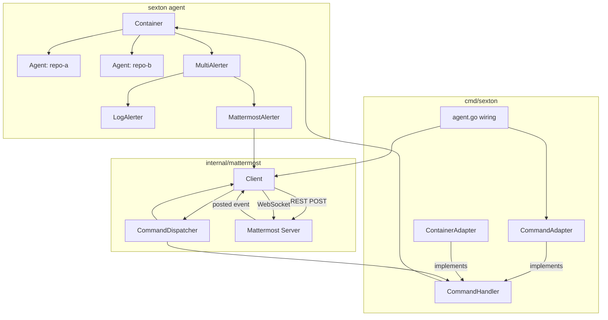
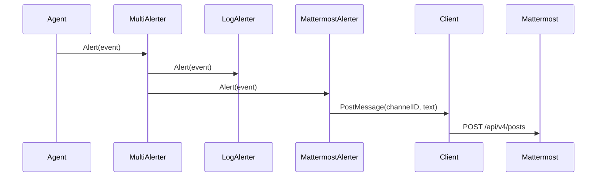
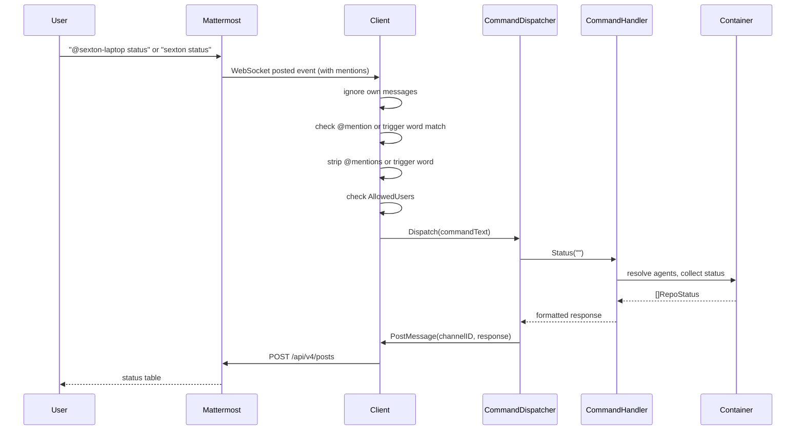

# Mattermost Integration for Sexton

## Context

Sexton currently has a single `LogAlerter` that writes sync events to the log. This document describes an integration with a local Mattermost instance that provides both **outbound alerts** (sync completions, errors, state changes posted to a channel) and **inbound commands** (user sends `status`, `sync`, `snooze`, `resume` via Mattermost messages and gets responses). This turns Mattermost into a lightweight control plane alongside the existing gRPC/CLI interface.

The following events produce outbound alerts:

- **sync complete** (info) -- after a successful sync with changes (existing)
- **error state change** (error) -- when error detail changes, deduplicated (existing)
- **snoozed** (info) -- when a repo is snoozed (new `a.alert()` call in `Snooze()`)
- **resumed** (info) -- when a snoozed or errored repo is resumed (new `a.alert()` call in `Resume()`)
- **recovered from error** (info) -- when a previously-errored repo completes a sync successfully (new, in `completeSync()` — capture `wasError := a.state == Error` under lock before transitioning)

## Mattermost Client Library

Use raw HTTP (`net/http`) + `gorilla/websocket` rather than the official Mattermost Go client library. The official library pulls in a large dependency tree; sexton favors simplicity and minimal dependencies. The needed API surface is small:

| Endpoint | Purpose |
|----------|---------|
| `GET /api/v4/users/me` | resolve bot user ID (to ignore own messages) |
| `GET /api/v4/users/{id}` | resolve user IDs to usernames (for allowlist check) |
| `POST /api/v4/posts` | post messages (alerts and command responses) |
| `WS /api/v4/websocket` | receive real-time events (incoming messages) |

## Configuration

Expand the existing `AlertConfig` in `internal/config/model.go` and add a `MattermostConfig` type:

```go
type AlertConfig struct {
    Type       string
    Mattermost *MattermostConfig
}

type MattermostConfig struct {
    URL          string
    Token        string   // direct token value (fallback)
    TokenEnv     string   // env var name containing token (preferred)
    ChannelID    string   // channel for alerts and commands
    TriggerWords []string // prefix to recognize commands (default: ["sexton"])
    AllowedUsers []string // usernames authorized to send commands (empty = allow all)
}
```

Example YAML:

```yaml
alerts:
  - type: mattermost
    mattermost:
      url: https://mm.local
      token_env: MATTERMOST_TOKEN
      channel_id: abc123def
      trigger_words:
        - sexton
      allowed_users:
        - michael
```

YAML keys use snake_case, matching project convention (`api_key_env`, `poll_interval`, etc.). The `df/dd` library auto-converts snake_case YAML keys to PascalCase Go struct fields.

- Token should come from an environment variable (`TokenEnv`) rather than being embedded in the config file. `Token` is a convenience fallback, following the same pattern as `LLMConfig.APIKeyEnv`.
- `AllowedUsers` restricts who can issue commands. If empty, all users who can post in the channel/DM can send commands.
- `TriggerWords` defaults to `["sexton"]` if not specified.
- Do not add yaml struct tags to these types. The `df/dd` library handles YAML binding via field name matching.

### Addressing and Multi-Instance

Multiple sexton instances may share a Mattermost channel (e.g., one per workstation, each watching local copies of the same repos). Each instance connects with its own bot account (`@sexton-laptop`, `@sexton-desktop`, etc.), giving it a distinct Mattermost identity. Two addressing mechanisms coexist:

- **Targeted (mention)**: `@sexton-laptop status` — the bot checks if its own user ID appears in the post's `data.mentions` field (a JSON array of mentioned user IDs included in WebSocket `posted` events). If mentioned, it strips all `@username` tokens from the message text and parses the remainder as a command. No trigger word is required for mention-based commands.
- **Multi-target (mention)**: `@sexton-laptop @sexton-desktop sync grimoire` — each mentioned bot sees itself in the mention list and executes independently.
- **Broadcast (trigger word)**: `sexton status` — the shared trigger word causes all instances in the channel to respond. This uses the existing `TriggerWords` config field.

No additional config fields are needed for multi-instance support. The bot's identity comes from its Mattermost account, resolved at startup via `GET /api/v4/users/me` (both `id` and `username`).

Alerts are attributed by Mattermost's own post sender display — the bot username is shown on each post, so alert text does not need an instance prefix.

**Ingress policy**: commands are accepted from any channel where the bot receives a `posted` WebSocket event, via either mention or trigger word matching, subject to `AllowedUsers` filtering. Alerts are posted only to the configured `ChannelID`. Command responses are posted to the originating channel (supporting both the configured channel and DMs).

## Package Structure

```
internal/mattermost/
  client.go          # REST + WebSocket client, lifecycle (Start/Stop)
  alerter.go         # MattermostAlerter implementing agent.Alerter
  commands.go        # CommandHandler interface, parser, dispatcher
  commands_test.go   # command parsing tests
  formatter.go       # alert event -> mattermost markdown
  formatter_test.go  # formatting tests
```

## Architecture

### Component Diagram



### Message Flow: Outbound Alert



### Message Flow: Inbound Command



## Existing Code Context

This section documents the existing interfaces and patterns that the implementation must integrate with. An implementing agent should read the referenced files but can use this section as a guide.

### Alerter Interface (`internal/agent/alerter.go`)

The current file defines the interface and the only existing implementation:

```go
type AlertEvent struct {
    Severity  string    // "error", "warning", or "info"
    RepoPath  string    // repo name (from config)
    Message   string
    Error     error     // may be nil
    Timestamp time.Time
}

type Alerter interface {
    Alert(ctx context.Context, event AlertEvent) error
}

type LogAlerter struct{}
// logs to df/dl based on severity
```

The alerter is called from two sites in `internal/agent/agent.go`:
- Line 469: `a.alert("info", "sync complete ("+sha+")", nil)` -- after a successful sync with changes
- Line 571: `a.alert("error", message, err)` -- when an error state changes (deduplicated; only fires when error detail differs from previous)

Both go through the private helper at line 585:
```go
func (a *Agent) alert(severity, message string, err error) {
    _ = a.alerter.Alert(context.Background(), AlertEvent{...})
}
```

### Container and Alerter Wiring (`internal/agent/container.go`)

The alerter is created as a hardcoded `LogAlerter` on line 34 of `container.go`:

```go
c := &Container{
    LLM:     llm.NewClient(cfg.LLM),
    Alerter: &LogAlerter{},
}
```

The `Container` struct (line 12):
```go
type Container struct {
    LLM     *llm.Client
    Alerter Alerter
    Agents  []*Agent
}
```

Agents receive the alerter via `Wire()` in `internal/agent/agent.go` (line 71):
```go
func (a *Agent) Wire(c *Container) error {
    a.llm = c.LLM
    a.alerter = c.Alerter
    return nil
}
```

**Key point**: `Wire()` is called by `da.Run()` before `Start()`. The alerter on `Container` must be set before `da.Run()` is called. The wiring in `cmd/sexton/agent.go` must replace `c.Alerter` between `NewContainer()` and `da.Run()`.

### The containerAdapter Pattern (`cmd/sexton/agent.go`)

This is the file that wires everything together. The current flow is:

```go
func runAgent(_ *cobra.Command, _ []string) error {
    cfg, err := config.Load(agentConfigPath)
    // ...
    c, err := agent.NewContainer(cfg)
    // ...
    srv := rpc.NewServer(config.SocketPath(), &containerAdapter{c: c})
    if err := srv.Start(); err != nil { return err }
    defer srv.Stop()
    return da.Run(c)
}
```

The `containerAdapter` bridges `agent.Container` to `rpc.AgentController` (defined in `internal/rpc/controller.go`):

```go
type containerAdapter struct {
    c *agent.Container
}

func (a *containerAdapter) RepoStatus(repo string) ([]rpc.RepoInfo, error) { ... }
func (a *containerAdapter) TriggerSync(repo string) error { ... }
func (a *containerAdapter) SnoozeRepo(repo string, d time.Duration) (time.Time, error) { ... }
func (a *containerAdapter) ResumeRepo(repo string) error { ... }
```

Each method calls `a.resolveAgent(repo)` which delegates to `a.c.ResolveAgent(repo)` and translates `agent.LookupError` into `rpc.ErrRepoNotFound` / `rpc.ErrAmbiguousRepo`.

The `agentToRepoInfo()` function (line 113) converts `*agent.Agent` to `rpc.RepoInfo`.

**For the Mattermost integration**: the `containerAdapter` already implements methods equivalent to what `mattermost.CommandHandler` needs. Either have `containerAdapter` implement both interfaces, or create a thin `mattermostAdapter` that wraps `containerAdapter` and translates `rpc.RepoInfo` to `mattermost.RepoStatus`.

### RPC AgentController Interface (`internal/rpc/controller.go`)

```go
type AgentController interface {
    RepoStatus(repo string) ([]RepoInfo, error)
    TriggerSync(repo string) error
    SnoozeRepo(repo string, d time.Duration) (time.Time, error)
    ResumeRepo(repo string) error
}
```

The `mattermost.CommandHandler` interface should mirror this shape but use its own `RepoStatus` type to avoid the mattermost package importing the rpc package.

### Command Grammar

Commands are recognized via two paths (see Addressing and Multi-Instance in Configuration):

1. **Mention path**: if the bot is `@mentioned`, strip all `@username` tokens from the message and parse the remainder as a command. No trigger word required.
2. **Trigger word path**: if the message starts with a trigger word (default `sexton`, case-insensitive, matched at word boundary), strip it and parse the remainder.

In both cases, the remainder is parsed as whitespace-delimited tokens.

| Command | Form | Notes |
|---------|------|-------|
| status | `sexton status [repo]` | repo optional; omit returns all repos |
| sync | `sexton sync <repo>` | repo required |
| snooze | `sexton snooze <repo> <duration>` | both required; duration uses Go `time.ParseDuration` format (`30m`, `2h`, `1h30m`) |
| resume | `sexton resume <repo>` | repo required |
| help | `sexton help` | list available commands |

Edge cases:

- **bare trigger word** (`sexton`) -- returns help text
- **unknown subcommand** (`sexton foo`) -- returns `"unknown command 'foo'"` followed by help text
- **missing required args** (`sexton sync`) -- returns command-specific error (e.g., `"sync requires a repo argument"`), not generic help
- **malformed duration** (`sexton snooze repo xyz`) -- returns `"invalid duration 'xyz'"`
- **repo resolution** -- uses the same `ResolveAgent` logic as the RPC layer; ambiguous matches return `"'notes' is ambiguous"`, not-found returns `"repo 'foo' not found"`

Examples with multi-instance addressing:

```
# targeted to one instance (mention, no trigger word needed)
@sexton-laptop status
@sexton-laptop sync grimoire

# targeted to multiple instances
@sexton-laptop @sexton-desktop sync grimoire

# broadcast to all instances (trigger word)
sexton status
sexton sync grimoire
```

### RPC Server Lifecycle Pattern (`internal/rpc/server.go`)

The RPC server follows a `Start()`/`Stop()` lifecycle managed in `cmd/sexton/agent.go`:

```go
srv := rpc.NewServer(socketPath, ctrl)
srv.Start()
defer srv.Stop()
```

The Mattermost client should follow this same pattern: `Start()` before `da.Run()`, `defer Stop()` for cleanup.

### Config Loading (`internal/config/load.go`)

Config is loaded via `dd.MergeYAMLFile()` which binds YAML keys to struct fields by name. **Do not use yaml struct tags** -- the `df/dd` library does its own field name matching. This is a project convention documented in CLAUDE.md.

The `LLMConfig.APIKeyEnv` pattern (see `internal/llm/client.go` line 32) resolves tokens from environment variables:

```go
var apiKey string
if cfg.APIKeyEnv != "" {
    apiKey = os.Getenv(cfg.APIKeyEnv)
}
```

Use this same pattern for `MattermostConfig.TokenEnv`.

### Test Patterns (`internal/agent/agent_test.go`)

Tests use stubs and recording types:

```go
type recordingAlerter struct {
    events []AlertEvent
}

func (a *recordingAlerter) Alert(_ context.Context, event AlertEvent) error {
    a.events = append(a.events, event)
    return nil
}
```

Agents are created for testing via `newAgentForTest(g gitClient, alerter Alerter)` which wires up a `stubGit` and alerter without needing a full Container.

For HTTP-based testing, `internal/llm/client.go` uses `net/http/httptest` servers. Follow this same pattern for the Mattermost REST client tests.

### Current go.mod Dependencies

```
module github.com/michaelquigley/sexton
go 1.26.1

require (
    github.com/michaelquigley/df v0.3.11
    github.com/spf13/cobra v1.10.2
    google.golang.org/grpc v1.79.2
    google.golang.org/protobuf v1.36.11
)
```

The only new dependency will be `github.com/gorilla/websocket`.

## Implementation Details

### Step 1: Config Model Changes

**File**: `internal/config/model.go`

Expand `AlertConfig` (currently just `Type string`) to include `Mattermost *MattermostConfig`. Add the `MattermostConfig` struct. No yaml tags.

### Step 2: MultiAlerter (`internal/agent/alerter.go`)

Add to the existing file. The `MultiAlerter` composes multiple alerters and calls all of them:

```go
type MultiAlerter struct {
    Alerters []Alerter
}

func (m *MultiAlerter) Alert(ctx context.Context, event AlertEvent) error {
    var errs []error
    for _, a := range m.Alerters {
        if err := a.Alert(ctx, event); err != nil {
            errs = append(errs, err)
        }
    }
    return errors.Join(errs...)
}
```

Add `"errors"` to the imports.

### Step 3: Formatter (`internal/mattermost/formatter.go`)

Create this file first since it has no external dependencies. It should contain:

- `FormatAlert(event agent.AlertEvent) string` -- formats an alert event as Mattermost markdown
- `FormatStatus(statuses []RepoStatus) string` -- formats status list as a markdown table
- `FormatSyncResponse(repo string) string` -- confirmation message
- `FormatSnoozeResponse(repo string, until time.Time) string` -- snooze confirmation
- `FormatResumeResponse(repo string) string` -- resume confirmation
- `FormatError(err error) string` -- error response
- `FormatHelp() string` -- list of available commands

All output should be lowercase. Dynamic data in single quotes (e.g., `sync triggered for 'my-notes'`). No emoji.

### Step 4: Command Parser + Interface (`internal/mattermost/commands.go`)

Define the `CommandHandler` interface and `RepoStatus` type. Implement the command parser:

```go
type CommandHandler interface {
    Status(repo string) ([]RepoStatus, error)
    Sync(repo string) error
    Snooze(repo string, duration time.Duration) (time.Time, error)
    Resume(repo string) (string, error)
}

type RepoStatus struct {
    Name            string
    Path            string
    State           string
    Branch          string
    LastSync        time.Time
    LastCommit      string
    LastChange      time.Time
    Error           string
    SnoozeRemaining time.Duration
    HoldoutRemaining time.Duration
}
```

`RepoStatus` maintains parity with `rpc.RepoInfo`, including `LastChange`, `SnoozeRemaining`, and `HoldoutRemaining`. These are useful in a status table because users want to see when content last changed and how long any pause has left.

The dispatcher function should:
1. Accept the raw message text and a list of trigger words
2. Check if the message starts with any trigger word (case-insensitive)
3. Strip the trigger word, tokenize the remainder
4. Dispatch based on first token to the appropriate `CommandHandler` method
5. Return the formatted response string (using the formatter)

Export two functions:

- `Dispatch(commandText string, handler CommandHandler) (string, bool)` -- takes pre-stripped command text (trigger word or `@mentions` already removed). The bool indicates whether the text was recognized as a command. This keeps the dispatch logic testable independently of the WebSocket client.
- `StripTriggerWord(text string, triggerWords []string) (string, bool)` -- checks if text starts with a trigger word (case-insensitive, word boundary), strips it, and returns the remainder. Used by `listen()` in the trigger word path.

See the Command Grammar section above for dispatch behavior on edge cases.

### Step 5: Mattermost Client (`internal/mattermost/client.go`)

```go
type Client struct {
    cfg         *config.MattermostConfig
    token       string
    botUserID   string
    botUsername string
    handler     CommandHandler
    userCache   map[string]string // user ID -> username
    stopCh      chan struct{}
    doneCh      chan struct{}
}
```

**`NewClient(cfg *config.MattermostConfig) *Client`**

Constructor. Resolves token from `cfg.TokenEnv` (via `os.Getenv`) with fallback to `cfg.Token`. Same pattern as `llm.NewClient`.

**`Start(handler CommandHandler) error`**

1. Call `GET /api/v4/users/me` with `Authorization: Bearer <token>` header
2. Parse response to extract `id` and `username` fields -- these are the bot's user ID and username
3. Store the handler
4. Open WebSocket connection to `ws(s)://<host>/api/v4/websocket` with `Authorization: Bearer <token>` in the HTTP upgrade header (simpler and more reliable than a post-connect authentication challenge message; if targeting a legacy Mattermost version that requires the challenge flow, send `{"seq":1,"action":"authentication_challenge","data":{"token":"..."}}` after connecting instead)
5. Launch `listen()` goroutine
6. Return nil on success

**Startup failure policy**: missing token, authentication failure, or bad configuration fails the entire agent startup. This matches the `rpc.Server` pattern — no silent degradation to log-only alerting. If the user wants log-only, they remove the mattermost alert config entry.

**`Stop()`**

1. Close `stopCh`
2. Close WebSocket connection (which unblocks the read in `listen()`)
3. Wait for `doneCh`

**`PostMessage(channelID, text string) error`**

POST to `/api/v4/posts` with JSON body `{"channel_id": "<id>", "message": "<text>"}` and auth header.

**`listen()`**

Loop:
1. Read message from WebSocket
2. Parse as JSON; check `event` field == `"posted"`
3. Extract `data.post` (JSON string), parse to get `user_id`, `channel_id`, `message`. Also extract `data.mentions` (JSON array of user ID strings).
4. If `user_id` == `botUserID`, skip (ignore own messages)
5. If `AllowedUsers` is non-empty, resolve `user_id` to username via cache or `GET /api/v4/users/{id}`, skip if not in allowlist
6. Determine command text via two paths:
   - **Mention path**: if `botUserID` is in `data.mentions`, strip all `@username` tokens from the message text (using a regex like `@\S+`) and use the remainder as command text. No trigger word required.
   - **Trigger word path**: if the message starts with a trigger word, strip it and use the remainder as command text.
   - If neither path matches, skip the message.
7. Call `Dispatch(commandText, handler)` (the trigger word stripping is now handled before dispatch)
8. If recognized, `PostMessage(post.channelID, response)` -- respond in the originating channel (supports both configured channel and DMs per the ingress policy)
9. On WebSocket error, attempt reconnection with exponential backoff (1s, 2s, 4s, ... up to 30s)
10. On `stopCh` close, exit

**Stop/reconnect synchronization**:
- A `sync.Mutex` protects the WebSocket connection handle (used by `listen()` for reads and shared with reconnect logic)
- `Stop()` closes `stopCh`, then closes the WebSocket connection (unblocking reads), then waits for `doneCh`
- The reconnect backoff loop checks `stopCh` at each iteration via `select` — if closed, exits instead of reconnecting
- `PostMessage` uses REST (not the WebSocket), so it is independent of WebSocket state. Post failures after startup are logged, not retried — alert delivery is best-effort, matching `LogAlerter` behavior

**`resolveUsername(userID string) (string, error)`**

Check `userCache` first. On miss, call `GET /api/v4/users/{id}`, parse `username` field, cache and return.

### Step 6: MattermostAlerter (`internal/mattermost/alerter.go`)

Thin wrapper:

```go
type MattermostAlerter struct {
    client    *Client
    channelID string
}

func NewAlerter(client *Client, channelID string) *MattermostAlerter {
    return &MattermostAlerter{client: client, channelID: channelID}
}

func (a *MattermostAlerter) Alert(ctx context.Context, event agent.AlertEvent) error {
    text := FormatAlert(event)
    return a.client.PostMessage(a.channelID, text)
}
```

### Step 7: Wiring (`cmd/sexton/agent.go`)

The updated `runAgent` function:

```go
func runAgent(_ *cobra.Command, _ []string) error {
    cfg, err := config.Load(agentConfigPath)
    if err != nil {
        return err
    }

    c, err := agent.NewContainer(cfg)
    if err != nil {
        return err
    }

    adapter := &containerAdapter{c: c}

    srv := rpc.NewServer(config.SocketPath(), adapter)
    if err := srv.Start(); err != nil {
        return err
    }
    defer srv.Stop()

    // build alerter from config
    alerter, mmCleanup, err := buildAlerter(cfg.Alerts, adapter)
    if err != nil {
        return err
    }
    if mmCleanup != nil {
        defer mmCleanup()
    }
    c.Alerter = alerter

    return da.Run(c)
}
```

Add a `buildAlerter` function that iterates all `cfg.Alerts` entries and constructs alerters:

- `type: log` (or empty string) -- `LogAlerter`
- `type: mattermost` -- `MattermostAlerter` (requires non-nil `Mattermost` field; error if missing)
- unknown type -- return error at startup (e.g., `"unknown alert type 'foo'"`)
- empty alerts list -- default to `LogAlerter` (preserves current behavior)
- duplicate mattermost entries -- allowed (each creates its own client)
- single alerter -- use directly; multiple -- wrap in `MultiAlerter`

Add a `mattermostAdapter` that wraps `containerAdapter` and implements `mattermost.CommandHandler`, converting `rpc.RepoInfo` to `mattermost.RepoStatus`:

```go
type mattermostAdapter struct {
    ca *containerAdapter
}

func (a *mattermostAdapter) Status(repo string) ([]mattermost.RepoStatus, error) {
    infos, err := a.ca.RepoStatus(repo)
    if err != nil {
        return nil, err
    }
    var out []mattermost.RepoStatus
    for _, info := range infos {
        out = append(out, mattermost.RepoStatus{
            Name:       info.Name,
            Path:       info.Path,
            State:      info.State,
            Branch:     info.Branch,
            LastSync:   info.LastSync,
            LastCommit: info.LastCommit,
            LastChange:      info.LastChange,
            Error:           info.Error,
            SnoozeRemaining: info.SnoozeRemaining,
        })
    }
    return out, nil
}

func (a *mattermostAdapter) Sync(repo string) error {
    return a.ca.TriggerSync(repo)
}

func (a *mattermostAdapter) Snooze(repo string, d time.Duration) (time.Time, error) {
    return a.ca.SnoozeRepo(repo, d)
}

func (a *mattermostAdapter) Resume(repo string) error {
    return a.ca.ResumeRepo(repo)
}
```

### Step 8: `go mod tidy`

Run `go get github.com/gorilla/websocket` then `go mod tidy`.

## Project Rules

These rules from `CLAUDE.md` apply to all code written for this feature:

- Go files named camelCase: `mattermostClient.go` not `mattermost_client.go`. Tests: `commands_test.go`.
- Comments start with lowercase unless the first word is an uppercase Go type.
- All user-facing outputs prefer lowercase. Dynamic data in single quotes.
- No emoji anywhere.
- No yaml struct tags on config types (df/dd handles binding).
- Clean up any build artifacts.

## Security

- Token should come from an environment variable, not embedded in YAML config.
- `AllowedUsers` constrains who can issue commands. If empty, all users in the channel can send commands.
- Bot ignores its own messages (filtered by bot user ID resolved at startup).
- User ID to username resolution is cached in memory to avoid repeated API calls.
- `AllowedUsers` uses usernames rather than user IDs for ergonomics — user IDs are opaque UUIDs that would require API lookups to configure. The tradeoff is that Mattermost username renames require a corresponding config update. This is acceptable for the target deployment (self-hosted instances where username changes are rare and controlled).

## Files Modified

| File | Change |
|------|--------|
| `internal/config/model.go` | add `MattermostConfig`, expand `AlertConfig` |
| `internal/agent/alerter.go` | add `MultiAlerter` |
| `cmd/sexton/agent.go` | wire up Mattermost client lifecycle, add adapters |
| `go.mod` | add `github.com/gorilla/websocket` |

## Files Created

| File | Purpose |
|------|---------|
| `internal/mattermost/client.go` | REST + WebSocket client |
| `internal/mattermost/alerter.go` | `MattermostAlerter` implementing `agent.Alerter` |
| `internal/mattermost/commands.go` | `CommandHandler` interface + command parser/dispatcher |
| `internal/mattermost/commands_test.go` | command parsing unit tests |
| `internal/mattermost/formatter.go` | message formatting |
| `internal/mattermost/formatter_test.go` | formatting unit tests |

## Implementation Order

1. Config model changes (`MattermostConfig`, expand `AlertConfig`)
2. `MultiAlerter` in `internal/agent/alerter.go`
3. Formatter + tests (no external deps)
4. Command parser + `CommandHandler` interface + tests (no external deps)
5. Mattermost client (adds `gorilla/websocket` dep)
6. `MattermostAlerter` (thin wrapper around client)
7. Wiring in `cmd/sexton/agent.go`
8. `go mod tidy`

## Testing

**Unit tests (no Mattermost server needed):**

- `commands_test.go` -- test command parsing in isolation with a mock `CommandHandler`. Feed message strings through the parser and verify correct method calls with correct arguments. Test: trigger word matching, case insensitivity, unknown commands return help, missing required args return error messages.
- `formatter_test.go` -- test alert and status formatting. Create `AlertEvent` and `RepoStatus` values and verify output strings match expected markdown.
- `MultiAlerter` -- test with stub alerters that record calls and optionally return errors. Verify all alerters are called even if one errors. Test in `internal/agent/alerter_test.go`.

**Integration testing pattern:** for the REST client, use `httptest.NewServer` to mock Mattermost API endpoints (same pattern as `internal/llm/client.go` which uses `net/http` directly). WebSocket end-to-end testing requires a real or heavily-mocked Mattermost server and is out of scope for the unit test suite.

**Additional unit tests** (`client_test.go`):

- Token resolution: `TokenEnv` env var set -- uses env var; `TokenEnv` empty + `Token` set -- uses direct token; both empty -- `Start()` returns error
- Self-message suppression: posted event with bot's own user ID is not dispatched
- Allowed-user filtering: user in allowlist -- dispatch occurs; user not in allowlist -- silently ignored; empty allowlist -- all users allowed
- Username cache: second lookup for same user ID does not make an HTTP request
- `buildAlerter` (in `cmd/sexton/agent_test.go`): empty list returns `LogAlerter`; explicit `type: log` returns `LogAlerter`; unknown type returns error; `type: mattermost` with nil config returns error; multiple entries produce `MultiAlerter`
- Shutdown during reconnect: `Stop()` unblocks backoff wait via `stopCh`

## Verification

1. `go build ./cmd/sexton` -- compiles
2. `go test ./...` -- all tests pass (including new tests)
3. Manual: run sexton agent with mattermost config, verify alerts appear in configured channel
4. Manual: send `sexton status` in channel, verify formatted table response
5. Manual: send `sexton sync <repo>` in channel, verify sync triggers and confirmation posted
6. Manual: send command from a user not in `AllowedUsers`, verify it is silently ignored
7. Manual: send command via DM to bot user, verify response in DM (supported per ingress policy -- trigger word + allowlist provide access control)
8. Manual: kill and restart agent, verify WebSocket reconnects with backoff
