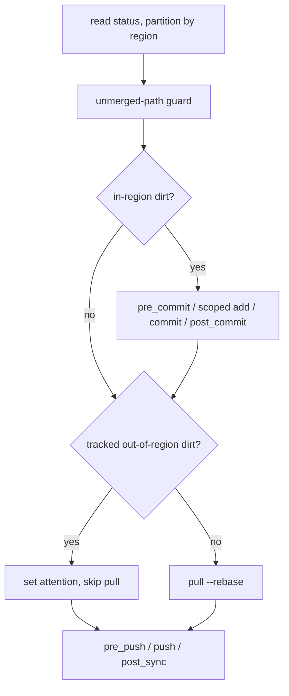

# commit policy

*Spec — August 2026. Consolidates the `auto-commit-regions` and `pull-only-repos` roadmap cards into one feature; they are the same policy with different parameters.*

Sexton today has exactly one commit posture: anything dirty gets staged, committed, and pushed. That posture is right for a knowledge repo whose whole tree is exhaust — a journal, a dataset — and wrong for two repos we actually run. The grimoire wants sexton committing `journal/` automatically while everything else stays the operator's review queue, per the commit-gate convention: the uncommitted diff *is* the queue, and an agent (sexton included) committing it would be accepting work on the operator's behalf. terminus-canon wants sexton keeping machines in sync without ever creating a commit at all, because canon changes are deliberate.

Both wants reduce to a single question, asked per repo: **does sexton create commits here, and for which paths?** The commit policy answers that question and nothing else. Pulling, pushing, hooks, error handling, and alerting stay policy-blind, with one deliberate exception (the pull preflight, below). Operator-made commits ship under every policy — the clean-tree path already pulls and pushes, and the policy never touches it. If you committed it, you meant it, and sexton delivers it. If that posture ever needs to change, it changes by adding config, not by reinterpreting the policy.

## configuration

Two new per-repo fields, cascading like their neighbors:

```yaml
# .sexton.yaml in the grimoire
commit_policy: regions
commit_regions:
  - journal/
```

```yaml
# .sexton.yaml in terminus-canon
commit_policy: none
```

- **`commit_policy`** — a scalar, one of `all`, `regions`, `none`. Resolves first-non-empty across repo-local, global repo entry, global defaults. When no layer supplies a value, the policy defaults to `none` — and sexton complains: a warning-severity alert, once per daemon start per unconfigured repo, naming the repo and the defaulted policy. Setting the policy explicitly at any layer silences it. The migration keeps policy in-repo: each synced repo carries its own `.sexton.yaml` stating its policy, which rides the repo to every host — no host config changes at all. The global layers remain able to carry a policy, but the practice is that they don't.
- **`commit_regions`** — a list of directory prefixes, resolving like hooks and holdout windows: the first layer with a non-empty list wins entirely. Prefixes map directly onto git pathspecs for scoped staging. Globs are deferred.

The `none` default is a deliberate reversal of sexton's founding posture, and a breaking change: an unconfigured repo stops auto-committing on upgrade until its policy is stated. The reasoning is fail-safe direction. Creating a commit is the one act in the cycle that cannot be quietly taken back once pushed, and the binder silently ignores misspelled keys — under a default of `all`, a typo'd `commit_policy` line in the grimoire's `.sexton.yaml` would silently auto-commit the entire review queue. Under `none`, every configuration failure — missing file, misspelled key, forgotten line — lands on the never-commit side, where the cost is a nag instead of a pushed commit. Auto-commit becomes something a repo opts into by saying so.

The policy being a scalar rather than "regions with an empty list means pull-only" is forced by the cascade mechanics: list resolution is first-non-empty-wins, so an empty `commit_regions` is indistinguishable from an absent one. Pull-only must be sayable explicitly, so it is a policy value.

Because the repo-local layer participates, the policy travels *with the repo*. The grimoire's `.sexton.yaml` carries `regions` to every machine in the fleet that syncs it; no per-host configuration.

Validation follows the `model`-without-`endpoint` precedent: `commit_policy: regions` with no resolved regions is a load error, because the configuration would silently commit nothing. A `commit_regions` list under `all` or `none` is inert and documented as such rather than rejected — the cascade can legitimately layer a repo-local `commit_policy: all` over global defaults that carry regions, and rejecting the resolved combination would make that layering hostile. An unrecognized policy value is a load error. And a `.sexton.yaml` that exists but fails to parse never falls through to a lower layer's policy: the repo starts with its policy forced to `none` and a startup warning naming the broken file — it stays visible in status, keeps pulling, commits nothing, and squawks about dirt until the file is fixed. Binding is `dd:` tags as everywhere; never `yaml:`.

## the cycle under each policy

**`all`** — today's behavior, byte for byte, now opted into rather than assumed.

**`regions`** — the dirty-tree branch partitions the status by region prefix before doing anything else. Both conflict guards keep their jobs unchanged: `validateBranch` still catches an interrupted rebase, and the unmerged-path check still runs before any staging whenever the tree is dirty at all — a conflicted tree refuses to commit regardless of where the conflict sits relative to the regions.



When the in-region partition is non-empty, the commit block runs against it alone: `pre_commit` hooks, then a staging pass scoped to the region pathspecs instead of `git add -A`, then the commit. The commit lands first, carrying a minimal placeholder message; the final message — the LLM summary, or the mechanical description when no LLM is configured or the call fails — is then generated *from that exact commit object* and swapped in through an atomic compare-and-swap that refuses if anything else has moved the branch. Sexton can never reword a commit it did not create, no published message ever derives from anything but the committed object, and a crash or refused swap leaves the placeholder — spartan, never wrong. Describing the commit from the commit means the message, the file lists, and the content cannot disagree — and out-of-region WIP never reaches the prompt, staged or not, because a read of the commit is bounded by construction. A crash mid-flow leaves the mechanical message, which was already the fallback. Untracked files inside a region stage like any other change. Git only detects a rename once it is staged, so an unstaged move appears as a deletion plus an untracked file — and a staged move, though git records it as one rename entry, splits the same way, because a pathspec commit takes trees, not renames. Either way each endpoint is classified on its own side of the boundary: a move out of a region commits the deletion and squawks the new path, losing nothing — the old content is in history, the new content is on disk.

Anything dirty outside the regions raises the attention condition instead of being committed. What happens to the rest of the cycle depends on what kind of dirt it is, and this is the one place the policy reaches past the commit phase — the pull preflight. A rebase requires a clean tree; tracked out-of-region changes would make every `pull --rebase` fail, and autostash is forbidden outright — stash-and-pop is a working tree waiting to be discarded, and sexton never discards a working tree. So when *tracked* out-of-region changes stand, sexton skips the pull deliberately rather than manufacturing the same git failure every poll, and the attention detail says so. Untracked-only dirt does not block a rebase, so the pull proceeds around it; if an incoming change would overwrite an untracked file, that surfaces through the existing conflict handling.

The push is always attempted when local commits are ahead. In the common case — one active writer since the last sync — journal commits keep flowing to the remote while the out-of-region WIP waits for triage. When the remote has moved and the pull is paused, the push rejects as non-fast-forward and the repo shows `error` until the operator commits; that is the honest compound state, and it is accepted rather than special-cased (see the census).

The consequence worth stating plainly: in the grimoire, cross-machine sync is paced by the triage cadence. While tracked out-of-region WIP stands, pulls are paused and a moved remote turns the push away — the repo does not fully converge until the operator commits, and the operator has been @mentioned about exactly that. Sexton squawking here is the commit-gate convention growing an enforcement arm, not a malfunction.

**`none`** — the commit block never runs; `pre_commit` and `post_commit` hooks never fire. A clean tree pulls and pushes exactly as today, which is how operator-made commits propagate. Any dirt at all — tracked or untracked — raises attention, and tracked dirt pauses the pull under the same preflight rule. The `regions` description above covers `none` completely if you read it with an empty region set: every path is out-of-region.

## the attention state

A sixth state joins `watching`, `syncing`, `error`, `snoozed`, `holdout`: **`attention`** — the repo needs a human decision, and sexton is not broken. The distinction from `error` is the whole point of the state: `error` means sexton hit something it cannot resolve; `attention` means sexton resolved everything it is allowed to and is waiting on a call that belongs to the operator. The cycle keeps running in `attention` — in-region commits land, pushes go out when they can, polls continue. That holds even mid-triage: sexton's commit is scoped at the git level — a partial commit of the region paths, built regardless of what else the index carries — so out-of-region work the operator has staged can never be swept in; it stays staged, counts as tracked dirt like any other, and waits.

Mechanically, `setAttention(detail)` is a sibling of `setError`, inheriting its two best behaviors. Deduplication by detail: the detail string carries the sorted offending paths (capped, with a `+N more` overflow), so a repo with standing WIP pings once, and a *new* stray file changes the detail and pings again — escalation for free. Announced recovery: the first cycle that finds the condition gone clears the state and says so, the same shape as `recovered from error`. Paths beyond the cap changing without the visible set changing will not re-alert; accepted.

Precedence extends the existing asymmetric ordering: holdout outranks everything, snooze holds its place, and `error` outranks `attention` — a pull-only repo with local dirt *and* an unreachable remote shows the failure, not the nudge. Both conditions are re-evaluated every cycle, so when the error clears, attention re-asserts on the next poll; the state converges on whatever actually stands.

## reaching the operator

Attention is a new alert severity alongside `error`, `warning`, and `info`, and it is the mention-worthy one. The Mattermost alert entry grows one field:

```yaml
alerts:
  - type: mattermost
    mattermost:
      channel_id: "..."
      mention_users:
        - michael
```

`mention_users` carries usernames, the same register as `allowed_users`, and the formatter prepends the `@mentions` to attention-severity alerts only — the severity is model-side on the event, the mention is rendering, confined to the Mattermost formatter. Errors keep their current tone; extending mentions to them is one knob away if wanted, and deliberately not in v1. The log alerter renders attention at warning level, mention-free. Client de-duplication is unaffected: `mention_users` is egress policy like `channel_id`, so entries sharing an identity may differ on it freely — the ingress-policy restriction on `allowed_users` and `trigger_words` does not extend to it.

## scenarios

**The grimoire.** `.sexton.yaml` carries `regions` with `journal/`. An agent writes a journal entry; within a poll interval it is committed with an LLM message and pushed. An agent leaves edits in `concepts/` — the review queue doing its job — and Michael gets one `@michael` ping naming the paths; journal commits keep flowing meanwhile, and pulls pause if any of the WIP touches tracked files. Michael reviews and commits — his act of acceptance — and the next poll announces recovery, pulls, and converges the fleet.

**terminus-canon.** `.sexton.yaml` carries `none`. Canon edits made on any machine and committed there propagate everywhere on the next polls. A local uncommitted edit anywhere in the tree pings once and waits. Nothing is ever committed by sexton.

**The fleet.** No host's global config changes at all. Every synced repo — the journal and dataset repos opting back into `all`, the grimoire with its regions, terminus-canon with `none` — carries its policy in its own `.sexton.yaml`, and the repos themselves propagate the migration across the fleet. A repo missed in the migration commits nothing and says so at startup; a repo whose `.sexton.yaml` breaks gets its policy forced to `none` and says that too. Both failure modes chosen on purpose.

## seam census

- **policy / cycle** — *separate.* The policy gates commit creation only; pull, push, hooks, and alerting stay policy-blind except the pull preflight, which exists because a paused pull is a decision and a failed pull every 30 seconds is noise. Revisit: if a policy ever needs to gate pushes ("truly pull-only"), that arrives as new config, not as reinterpretation.
- **error by tier** — *separate states.* `attention` is an operator condition, `error` is a sexton failure; `error` outranks in display, both re-evaluated per cycle. The non-fast-forward push during a paused pull lands in `error` rather than being folded into attention — folding would require classifying push output, and the compound genuinely is a divergence the operator must resolve. Revisit: if that error proves noisy in practice, fold non-fast-forward-during-attention into the attention detail.
- **model / render** — *separate.* The attention severity lives on `AlertEvent`; the `@mention` is Mattermost rendering. The log alerter proves the seam by rendering the same event without one.
- **validation tier** — `regions` without regions fails at load (silently-does-nothing precedent: `model` without `endpoint`); a regions list under other policies is inert because the cascade can layer it legitimately. A *missing* policy is neither fatal nor silent: it defaults to `none` with a startup warning — failing startup would be hostile to a fleet mid-migration, and silence would let the binder's ignore-unknown-keys behavior hide a typo'd policy line. A *malformed* repo-local file forces `none` outright rather than resolving from lower layers, so a corrupted override can never inherit a broader policy. Revisit: none foreseen.

## deferred (and why)

- **Chat-ops acceptance.** The attention alert carrying a proposed commit message and a Mattermost `commit <repo>` command that accepts it — sexton executes, the acceptance is explicitly the operator's, the commit gate holds. The natural v2, deferred to keep v1 a policy change rather than a new command surface. Pairs with an LLM-generated summary of the out-of-region dirt in the alert itself, which is adjacent to the semantic-differs design.
- **Glob regions.** Prefixes cover both motivating repos; globs arrive when a real repo needs them, likely on the `doublestar` precedent the semantic-differs doc already establishes.
- **Mentions on error-class alerts.** One config knob, added when wanted.
- **Push gating.** Every policy pushes operator commits today, by decision. A policy that also withholds pushes is additional config if the posture ever changes.
- **Native git hook interaction.** A repo's own `pre-commit` hook that stages files during sexton's partial commit could carry out-of-region content into it — git runs native hooks against the temporary index of a path-limited commit. The fleet's synced repos carry no native hooks, and no machinery is added for a case that doesn't exist here; sexton's own lifecycle hooks are the supported mechanism. If a hooked repo ever joins the fleet, revisit — process-scoped hook disabling (`git -c core.hooksPath=`) and a temp-index plumbing commit are the known closures.
