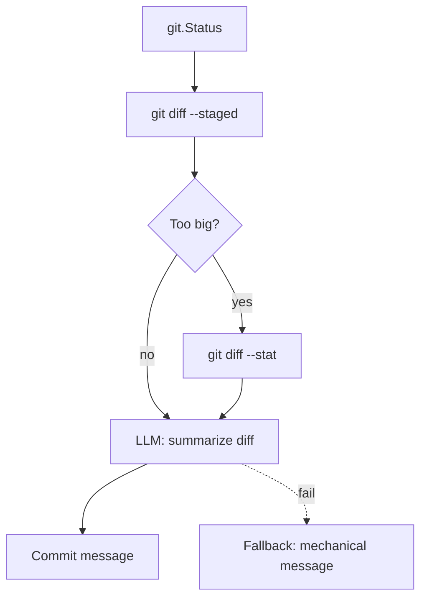
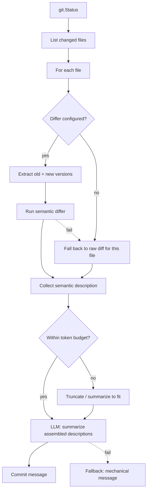

# Sexton Semantic Differs

*Vision document — March 2026. Carried from the grimoire's `software/sexton/` tree when the project-specific subtrees were dissolved (2026-07-06). Never implemented; the code references below describe the March-era codebase and should be re-verified against current internals before this becomes a work order.*

---

## Overview

Sexton currently generates commit messages by feeding a raw `git diff --staged` to an LLM. For many file types — especially binary-ish structured data stored as JSON, YAML, or domain-specific formats — the raw diff is noisy and semantically opaque. A wall of changed JSON keys tells the LLM very little about what actually changed in the domain.

Semantic differs are pluggable, per-file-type external tools that transform a raw file change into a domain-aware description. Sexton runs the appropriate differ for each changed file, assembles the semantic descriptions, and feeds *that* to the LLM instead of (or alongside) the raw diff. The result is commit messages that describe what changed in terms the domain understands.

### Motivating Example

The grimoire's baabhive contains `.baab` files — baab system files stored as JSON. A raw diff might show:

```diff
-  "velocity": [80, 80, 90, 80, 85, 80, 90, 80],
+  "velocity": [80, 85, 95, 80, 90, 85, 95, 80],
```

A semantic differ provided by baab could produce:

```
kick pattern: velocity curve shifted up on beats 2,3,5,6,7 (accent emphasis increased)
hi-hat pattern: unchanged
snare pattern: unchanged
```

The LLM would then generate a commit message like "Increase accent emphasis on kick velocity curve" rather than "Update velocity array values in pattern.baab".

---

## Design

### Where it fits in the sync loop

Semantic differs modify the **commit summarization** phase only. They do not affect staging, pulling, pushing, or any other part of the sync loop. The integration point is `Agent.generateCommitMessage()` in `internal/agent/agent.go`.

Current flow:



Proposed flow with semantic differs:



### Differ contract

A semantic differ is an external command that accepts two file paths (old version, new version) and writes a human-readable description of the change to stdout.

```
<command> <old_path> <new_path>
```

Exit code 0 means the differ produced output. Any non-zero exit means failure — sexton falls back to the raw git diff for that file. This makes differs completely non-critical: if the tool is missing, broken, or doesn't understand the input, sexton degrades gracefully.

For **newly added files** (no old version), sexton passes `/dev/null` as `<old_path>`. For **deleted files**, sexton passes `/dev/null` as `<new_path>`. The differ is expected to handle both cases.

### Extracting old and new versions

The differ needs actual files on disk, not a unified diff. For staged changes:

- **Old version (HEAD)**: `git show HEAD:<filepath>` written to a temp file
- **New version (index)**: `git show :<filepath>` written to a temp file

Both temp files are created in a sexton-managed temp directory and cleaned up after the differ runs. For new files (not in HEAD), the old path is `/dev/null`. For deleted files (not in index), the new path is `/dev/null`.

This requires a new method on the `Git` type:

```go
// ShowFile writes the contents of a file at a given ref to a temp file and returns the path.
// ref can be "HEAD", "HEAD~1", "" (index/staging area), etc.
// returns the temp file path. caller is responsible for cleanup.
func (g *Git) ShowFile(ref string, filepath string, tmpDir string) (string, error)
```

### Assembled output format

The differs produce per-file descriptions. Sexton assembles them into a single block that the LLM receives. The format should give the LLM enough structure to understand what's per-file vs. overall:

```
## Changed Files

### data/patterns/kick-heavy.baab (semantic diff)
kick pattern: velocity curve shifted up on beats 2,3,5,6,7 (accent emphasis increased)
hi-hat pattern: unchanged

### planning/state-of-the-work.md (raw diff)
@@ -12,3 +12,5 @@
- current focus: baab velocity modeling
+ current focus: sexton semantic differs
+ next: lore custodian agent

### data/metadata.json (raw diff)
@@ -1,3 +1,3 @@
-  "last_updated": "2026-03-17"
+  "last_updated": "2026-03-18"
```

Files with semantic differs are labeled `(semantic diff)`, files without are labeled `(raw diff)`. This helps the LLM understand it's receiving two different kinds of input.

### Token budget management

The current `maxDiffBytes` (32KB) cap applies to the assembled output, not per-file. The assembly process should:

1. Run semantic differs for all matching files first (they're typically much more compact than raw diffs).
2. Fill remaining budget with raw diffs for unmatched files, in order of file path.
3. If the total exceeds the budget, truncate raw diffs first (semantic descriptions are higher value).
4. If still over budget, fall back to `git diff --stat` for the raw-diff files.
5. If still over budget, fall back entirely to `git diff --stat` (current behavior).

### Differ timeout and failure

Each differ invocation has a configurable timeout (default: `10s`). This is shorter than hook timeouts because differs run per-file and shouldn't be doing heavy work.

On failure (non-zero exit, timeout, empty output), the file falls back to its raw diff. A warning is logged but the sync cycle is **not halted** — differ failure is never critical. This is a key difference from hooks: hooks are control flow (they can halt the agent), differs are informational (they only affect commit message quality).

---

## Implementation Plan

### 1. Config model changes (`internal/config/model.go`)

```go
type DifferEntry struct {
    Pattern string            // glob pattern, e.g. "*.baab", "data/**/*.json"
    Command string            // command template, e.g. "baab diff"
    Timeout string            // optional, default "10s"
    Env     map[string]string // optional extra environment variables
}
```

Add `Differs []*DifferEntry` to `RepoEntry`, `RepoLocalConfig`, and `RepoDefaults`.

Add resolved types:

```go
type ResolvedDiffer struct {
    Pattern string
    Command string
    Timeout time.Duration
    Env     map[string]string
}
```

Add `Differs []*ResolvedDiffer` to `ResolvedRepo`.

### 2. Config resolution (`internal/config/load.go`)

Merge differs following the same cascade as hooks: repo-local replaces global entirely (not concatenation). Parse timeouts, default to `10s`.

### 3. Differ runner (`internal/agent/differ.go` — new file)

Core function:

```go
// runDiffer executes a semantic differ for a single file change.
// returns the semantic description, or empty string on failure.
func (a *Agent) runDiffer(ctx context.Context, differ *config.ResolvedDiffer, oldPath, newPath string) string
```

This function:

- Creates a context with the differ's timeout.
- Runs `exec.CommandContext` with `sh -c <command> <oldPath> <newPath>`.
- Sets working directory to repo root.
- Sets `SEXTON_REPO_PATH`, `SEXTON_REPO_NAME`, plus any configured env vars.
- Captures stdout (the semantic description) and stderr (for logging on failure).
- Returns stdout on success, empty string on failure (with a warning log).

Matching function:

```go
// findDiffer returns the first configured differ whose pattern matches the given filepath.
// returns nil if no differ matches.
func (a *Agent) findDiffer(filepath string) *config.ResolvedDiffer
```

Uses `filepath.Match` (or `doublestar` for `**` glob support) to match patterns.

Assembly function:

```go
// buildSemanticDiff assembles per-file descriptions (semantic + raw) into a single
// string for the LLM, respecting the token budget.
func (a *Agent) buildSemanticDiff(ctx context.Context, status *git.Status) (string, error)
```

This is the main entry point, called from `generateCommitMessage`. It:

1. Iterates all changed files from `status`.
2. For each file, checks for a matching differ.
3. If matched: extracts old/new versions to temp files, runs the differ, collects output.
4. If not matched (or differ failed): gets the raw diff for that file via `git diff --staged -- <filepath>`.
5. Assembles the formatted output block.
6. Applies token budget truncation.
7. Cleans up temp files.

### 4. New git methods (`internal/git/git.go`)

```go
// ShowFile extracts a file at the given ref to a temp file.
// use "HEAD" for the committed version, "" for the staged version.
// returns temp file path. caller must clean up.
func (g *Git) ShowFile(ref string, filepath string, tmpDir string) (string, error)

// DiffStagedFile returns the staged diff for a single file.
func (g *Git) DiffStagedFile(filepath string) (string, error)
```

`ShowFile` runs `git show <ref>:<filepath>`, writes the output to a temp file named after the original file (preserving the extension, which matters for tools that inspect it), and returns the temp path.

`DiffStagedFile` runs `git diff --staged HEAD -- <filepath>`.

### 5. Integration into commit message generation (`internal/agent/agent.go`)

Modify `generateCommitMessage` to try semantic diff assembly first:

```go
func (a *Agent) generateCommitMessage(ctx context.Context, status *git.Status) string {
    fallback := git.GenerateCommitMessage(status)

    if a.llm == nil {
        return fallback
    }

    // try semantic diff assembly if any differs are configured
    var diff string
    var err error

    if len(a.cfg.Differs) > 0 {
        diff, err = a.buildSemanticDiff(ctx, status)
        if err != nil {
            dl.Warnf("semantic diff assembly failed for '%s': %v", a.cfg.Name, err)
        }
    }

    // fall back to raw diff if no semantic diff was produced
    if diff == "" {
        diff, err = a.git.DiffStaged()
        if err != nil {
            return fallback
        }
        if len(diff) > maxDiffBytes {
            diff, err = a.git.DiffStat()
            if err != nil {
                return fallback
            }
        }
    }

    result, err := a.llm.Complete(ctx, a.cfg.CommitMessagePrompt, diff, 0)
    if err != nil || result == "" {
        return fallback
    }

    return result
}
```

This is a clean layering: if differs are configured, try them. If that fails or produces nothing, fall back to the existing raw diff path. The rest of the LLM call and fallback chain is unchanged.

---

## Configuration Examples

### Baabhive with baab differ

```yaml
# ~/baabhive/.sexton.yaml

differs:
  - pattern: "*.baab"
    command: "baab diff"
    timeout: 15s
```

### Grimoire with a JSON summary tool

```yaml
# ~/grimoire/.sexton.yaml

differs:
  - pattern: "data/**/*.json"
    command: "jd"
    timeout: 5s
```

### Multiple differs per repo

```yaml
# .sexton.yaml

differs:
  - pattern: "*.baab"
    command: "baab diff"
  - pattern: "*.json"
    command: "jd"
  - pattern: "*.csv"
    command: "csv-diff"
    timeout: 30s
```

First matching pattern wins — if a file matches multiple patterns, the first differ in the list is used.

### Global config with per-repo differs

```yaml
# ~/.config/sexton/config.yaml

repos:
  - path: ~/baabhive
    differs:
      - pattern: "*.baab"
        command: "baab diff"
  - path: ~/grimoire
    # no differs — uses raw diff (default)
```

---

## Differ Tool Contract (for tool authors)

Sexton expects a semantic differ to behave as follows:

**Invocation**: `<command> <old_file> <new_file>`

**Arguments**:
- `old_file`: Path to the previous version of the file. `/dev/null` if the file is newly added.
- `new_file`: Path to the current version of the file. `/dev/null` if the file was deleted.

**Output**: A human-readable description of the changes, written to stdout. This will be passed to an LLM for commit message generation, so it should be concise and descriptive. Aim for a few lines, not a full diff.

**Exit code**: 0 on success, non-zero on failure. On failure, sexton falls back to the raw git diff.

**Environment variables** (set by sexton):
- `SEXTON_REPO_PATH` — absolute path to the repo root
- `SEXTON_REPO_NAME` — repo name from config
- Plus any custom env vars from the differ config

**Guidelines for tool authors**:
- Be concise. The output will compete for token budget with other file descriptions.
- Describe *what changed*, not the full state.
- Use domain language. "Kick velocity curve accent emphasis increased" is better than "array values at indices 1,2,4,5,6 increased".
- Handle `/dev/null` inputs gracefully (new files, deleted files).
- Exit non-zero if you can't produce useful output — sexton will fall back gracefully.

---

## Testing Strategy

- **Unit test `findDiffer`**: verify glob matching, first-match-wins behavior, no-match returns nil.
- **Unit test `runDiffer`**: successful command with output, non-zero exit (graceful fallback), timeout, empty stdout.
- **Unit test `buildSemanticDiff`**: mixed files (some with differs, some without), token budget truncation, all-differ-failures (falls back to raw diff).
- **Integration test**: configure a simple differ (e.g., `cat` or a script that echoes "file changed") and verify it appears in the assembled diff output sent to the LLM.
- **Config resolution test**: repo-local differs override global, empty differs list means no semantic diffing.

---

## Dependencies and Prerequisites

This feature depends on the **lifecycle hooks** infrastructure for its external command execution patterns (`exec.CommandContext`, timeout handling, env vars, stdout/stderr capture). The `runDiffer` function should reuse patterns established in `hooks.go`.

The `git.ShowFile` method is new functionality that needs to be added to the git package. This is the only non-trivial git operation required — everything else builds on existing methods.

No external Go dependencies are required. Glob matching is available in the standard library (`path/filepath.Match`). If `**` glob support is needed, `github.com/bmatcuk/doublestar` is a common, minimal dependency.

---

## Scope and Non-Goals

This document covers the sexton-side infrastructure for running semantic differs and assembling their output. It does **not** cover:

- Building the `baab diff` tool itself (that's a baab concern)
- Building any other specific differ tool
- LLM prompt tuning for semantic diff input (the existing `commit_message_prompt` config handles this — users can adjust their prompt to account for semantic diff content)
- Differ discovery or auto-configuration (differs are explicitly configured)
